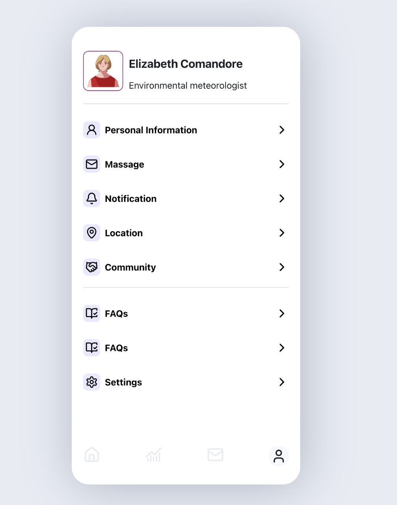

# Reflex-Modile_navigation

## # Mobile Navigation 

#### Welcome to the Reflex-**Mobile Navigation** project! This is a simple, clean, and responsive mobile navigation menu built using **Reflex** (formerly Nextpy). It’s designed to provide a seamless user experience on mobile devices, with smooth animations and a modern design.

## ## 📱 About the Project

#### This project demonstrates how to create a **mobile-friendly navigation menu** using Reflex. The navigation menu is fully responsive, meaning it adapts to different screen sizes and devices. It includes:

##### - A clean and minimalistic design.
- Easy customization to fit any project.
- Simple
- Easy to install on your project
- Castom component

# Install

> git clone https://github.com/AnonimPython/Reflex-mobile_navigation.git
>
> pip install reflex
>
> cd modile-navigation
>
> reflex run
